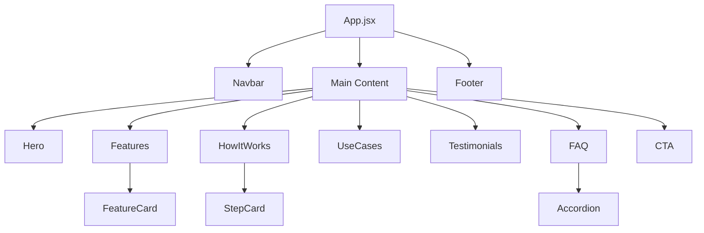

# Clueso.io Clone

A modern, responsive clone of the [Clueso.io](https://clueso.io) landing page built with React, showcasing AI-powered video creation capabilities. This project demonstrates advanced web development techniques including smooth animations, glassmorphism effects, and a vibrant gradient color scheme.


## ✨ Features

This clone includes all major sections of the Clueso.io landing page:

- **🎯 Hero Section**: Eye-catching hero with animated badge, gradient text, and demo image
- **🚀 Features Grid**: Six key AI-powered features with icon cards and hover effects
- **📋 How It Works**: 4-step process breakdown with numbered cards
- **💼 Use Cases**: Target audience showcase with 8 different use case categories
- **⭐ Testimonials**: Social proof section with ratings and company logos
- **❓ FAQ Section**: Accordion-style frequently asked questions
- **📢 Call-to-Action**: Compelling CTA section with gradient background
- **🔗 Footer**: Comprehensive footer with links and social media icons

### Design Highlights

- ✅ **Smooth Animations**: Framer Motion for scroll-triggered and hover animations
- ✅ **Glassmorphism**: Modern frosted glass effects on navbar
- ✅ **Gradient Accents**: Purple/pink gradient theme matching Clueso brand
- ✅ **Fully Responsive**: Mobile-first design that works on all screen sizes
- ✅ **Accessibility**: Semantic HTML and proper ARIA labels

## 🛠️ Tech Stack

- **Framework**: [React](https://react.dev/) 18.2.0
- **Build Tool**: [Vite](https://vitejs.dev/) 5.0.0
- **Animation**: [Framer Motion](https://www.framer.com/motion/) 11.0.0
- **Icons**: [Lucide React](https://lucide.dev/) 0.300.0
- **Styling**: Vanilla CSS with CSS Variables
- **Linting**: ESLint with React plugins

## 📦 Installation

### Prerequisites

- **Node.js**: Version 16.x or higher
- **npm**: Version 8.x or higher (comes with Node.js)

### Setup Instructions

1. **Clone the repository**
   ```bash
   git clone https://github.com/PriyaUttam123/Clueso.io.git
   cd Clueso.io
   ```

2. **Install dependencies**
   ```bash
   npm install
   ```

3. **Start the development server**
   ```bash
   npm run dev
   ```

4. **Open your browser**
   
   Navigate to [http://localhost:5173](http://localhost:5173)

## 🚀 Available Scripts

- **`npm run dev`**: Start development server with hot module replacement
- **`npm run build`**: Build for production (output in `dist/` folder)
- **`npm run preview`**: Preview production build locally
- **`npm run lint`**: Run ESLint to check code quality

## 📁 Project Structure

```
Clueso.io/
├── public/                     # Static assets
├── src/
│   ├── components/
│   │   ├── common/            # Reusable components
│   │   │   ├── Accordion.jsx/css
│   │   │   ├── Button.jsx/css
│   │   │   ├── FeatureCard.jsx/css
│   │   │   └── StepCard.jsx/css
│   │   ├── layout/            # Layout components
│   │   │   ├── Navbar.jsx/css
│   │   │   └── Footer.jsx/css
│   │   └── sections/          # Page sections
│   │       ├── Hero.jsx/css
│   │       ├── Features.jsx/css
│   │       ├── HowItWorks.jsx/css
│   │       ├── UseCases.jsx/css
│   │       ├── Testimonials.jsx/css
│   │       ├── FAQ.jsx/css
│   │       └── CTA.jsx/css
│   ├── App.jsx                # Main app component
│   ├── main.jsx               # App entry point
│   └── index.css              # Global styles & CSS variables
├── index.html                 # HTML template
├── package.json               # Dependencies & scripts
├── vite.config.js            # Vite configuration
└── README.md                  # This file
```

## 🏗️ Architecture Overview

### Component Hierarchy



### Design System

The project uses a centralized design system defined in `src/index.css`:

**Color Palette**:
- Primary Background: `#F9FAFB`
- White: `#FFFFFF`
- Text Primary: `#111827`
- Text Secondary: `#6B7280`
- Accent Purple: `#AC52BE`
- Accent Pink: `#CC52BC`
- Gradient: `linear-gradient(135deg, #CC52BC 0%, #AC52BE 100%)`

**Typography**:
- Font Family: Inter (Google Fonts fallback to system fonts)
- Heading sizes: 3.5rem (h1), 2.5rem (h2), 1.75rem (h3)
- Line heights optimized for readability

**Spacing**:
- Container max-width: 1200px
- Section padding: 80px vertical
- Consistent 1.5rem horizontal padding

### State Management

This is a **static landing page clone** with minimal state:
- Accordion open/close states (local component state)
- Navbar scroll state (local component state)
- No global state management needed

## 🎨 Design Decisions

### 1. **Vanilla CSS over Tailwind**
- **Why**: Maximum flexibility and control over styling
- **Benefit**: No build overhead, easier to customize, better understanding of CSS

### 2. **Component Co-location**
- **Why**: Each component has its own CSS file in the same directory
- **Benefit**: Better maintainability, easier to find and modify styles

### 3. **Framer Motion for Animations**
- **Why**: Declarative animation API, great React integration
- **Benefit**: Smooth scroll-triggered animations with minimal code

### 4. **CSS Variables for Theming**
- **Why**: Centralized color and spacing management
- **Benefit**: Easy to maintain and update design tokens

### 5. **Mobile-First Approach**
- **Why**: Progressive enhancement from mobile to desktop
- **Benefit**: Better performance on mobile devices

## 📝 Assumptions Made

1. **Static Content**: No backend integration or API calls
2. **No Authentication**: Login/signup buttons are placeholder links
3. **Placeholder Images**: Using Clueso's actual hero image from their CDN
4. **No Form Validation**: CTA buttons don't submit forms
5. **Simplified Mobile Menu**: Mobile nav is hidden but not fully functional
6. **No Video Playback**: "Watch Demo" button is decorative
7. **Company Logos**: Text placeholders instead of actual logo images

## 🐛 Known Limitations

- **Mobile Navigation**: Mobile menu button exists but doesn't open a drawer
- **Form Submissions**: No actual form handling or validation
- **Video Demo**: No embedded video player functionality
- **Language Selector**: Translation feature mentioned but not implemented
- **External Links**: All links are placeholder `#` anchors

## 🚧 Future Improvements

### Short-term
- [ ] Implement functional mobile navigation menu
- [ ] Add video modal for demo playback
- [ ] Create real company logo assets
- [ ] Add more micro-interactions and hover effects
- [ ] Implement dark mode toggle

### Long-term
- [ ] Backend integration with Node.js/Express
- [ ] User authentication system
- [ ] Contact form with email integration
- [ ] Blog section with CMS
- [ ] Multi-language support (i18n)
- [ ] Analytics integration (Google Analytics/Plausible)
- [ ] A/B testing framework
- [ ] Performance optimization (lazy loading, code splitting)

## 🤝 Contributing

This is a learning/portfolio project. If you'd like to contribute:

1. Fork the repository
2. Create your feature branch (`git checkout -b feature/AmazingFeature`)
3. Commit your changes (`git commit -m 'Add some AmazingFeature'`)
4. Push to the branch (`git push origin feature/AmazingFeature`)
5. Open a Pull Request

## 📄 License

This project is for educational purposes only. The design and branding belong to [Clueso.io](https://clueso.io).

## 🙏 Acknowledgments

- Design inspiration: [Clueso.io](https://clueso.io)
- Icons: [Lucide Icons](https://lucide.dev/)
- Font: [Inter](https://fonts.google.com/specimen/Inter) by Google Fonts
- Animation library: [Framer Motion](https://www.framer.com/motion/)

---

**Built with ❤️ by [Priya Uttam](https://github.com/PriyaUttam123)**

*Last updated: January 3, 2026*
